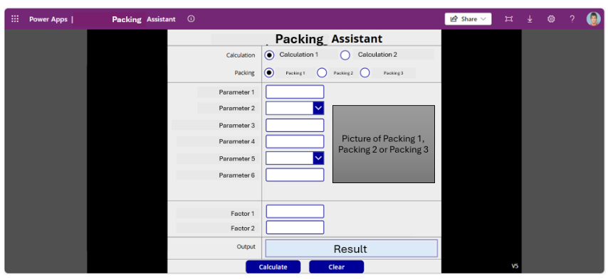

# 📦 Engineering Analytics Project | Packing Optimization Tool (Power Apps)

## 🚀 Overview
This project showcases a **Power Apps application** developed to support **engineering calculations for packing optimization**, ensuring material protection during **storage and transportation operations**.

The solution acts as a **decision-support system**, enabling users to perform **real-time load analysis**, reduce risk of damage, and improve **process efficiency** and **operational reliability**.

---

## 🎯 Business Problem  
Inefficient packing configurations can lead to material damage, increased costs, and suboptimal logistics operations in industrial environments.

---

## ✅ Business Impact  
- Enabled optimized packing calculations for improved material protection  
- Reduced risk of damage during transportation and storage  
- Improved efficiency in logistics and handling processes  
- Provided a scalable tool for engineering decision-making  

---

## 🎯 Business Context
In industrial and logistics environments, inadequate packing design can lead to:
- Material damage  
- Structural failure  
- Increased operational costs  

This application was developed to:
- Automate **engineering calculations**  
- Improve **packing design decision-making**  
- Enhance **material protection and safety**  
- Support **standardization of engineering processes**  

---

## ⚠️ Data Disclaimer
No proprietary or sensitive engineering data is included.

This project demonstrates:
- Engineering calculation workflows  
- Decision-support system design  
- Process automation using Power Apps  
- Practical application of industrial engineering principles  

---

## 🏗️ Solution Description

### 🔹 Packing Calculation Engine
The tool enables users to calculate:

- **Maximum load capacity** supported by materials based on physical properties  
- Required **packing support structure** for safe stacking and storage  
- Optimal conditions to **ensure structural integrity and prevent deformation**  

---

### 🔹 Power Apps Interface
Interactive application providing:

- **User-driven parameter selection**  
- Dynamic input of material characteristics  
- Real-time calculation outputs  
- Intuitive interface for engineering decision-making  

---

## 📈 Key Features
- **Engineering calculation automation**
- **Interactive decision-support system**
- **Dynamic parameter configuration**
- **Load analysis and structural evaluation**
- **Packing optimization for logistics operations**
- **Real-time calculation results**
- **Process standardization**
- **Risk reduction in material handling**

---

## 🧠 Methodology
The application follows a structured workflow:

1. User inputs material properties and load conditions  
2. System applies engineering formulas  
3. Load limits and support requirements are calculated  
4. Results are presented for operational decision-making  

---

## 📊 Use Cases
This tool supports scenarios such as:

- Evaluating if a material can withstand stacking loads  
- Designing appropriate packing configurations  
- Preventing material deformation or damage  
- Improving safety in storage and transportation processes  

---

## 🛠️ Tools & Technologies
- **Power Apps**
- **Engineering Calculations**
- **Process Automation**
- **Decision Support Systems**
- **Load Analysis**
- **Optimization**
- **Industrial Engineering**
- **Data Input Forms**
- **Risk Assessment**

---

## 💼 Business Impact
- Reduced manual engineering calculations  
- Improved **process consistency and efficiency**  
- Enhanced **material protection and product safety**  
- Lower risk of damage during logistics operations  
- Faster and more reliable **decision-making process**  

---

## 📌 Key Skills Demonstrated
- **Data Analytics applied to Engineering**
- **Power Apps Development**
- **Process Digitalization**
- **Decision Support System Design**
- **Engineering Modeling**
- **Optimization Techniques**
- **Industrial Engineering Applications**
- **Risk Assessment**

---

## 🔮 Future Improvements
- Integration with ERP or logistics systems  
- Expansion of engineering models  
- Predictive analysis for damage risk  
- Integration with Power BI dashboards for monitoring  

---

## 📄 Notes
This project demonstrates the application of **digital tools in engineering processes**, combining **automation, data-driven decision-making, and industrial optimization**, aligned with roles in **Data Analytics, Industrial Engineering, and Digital Transformation**.
